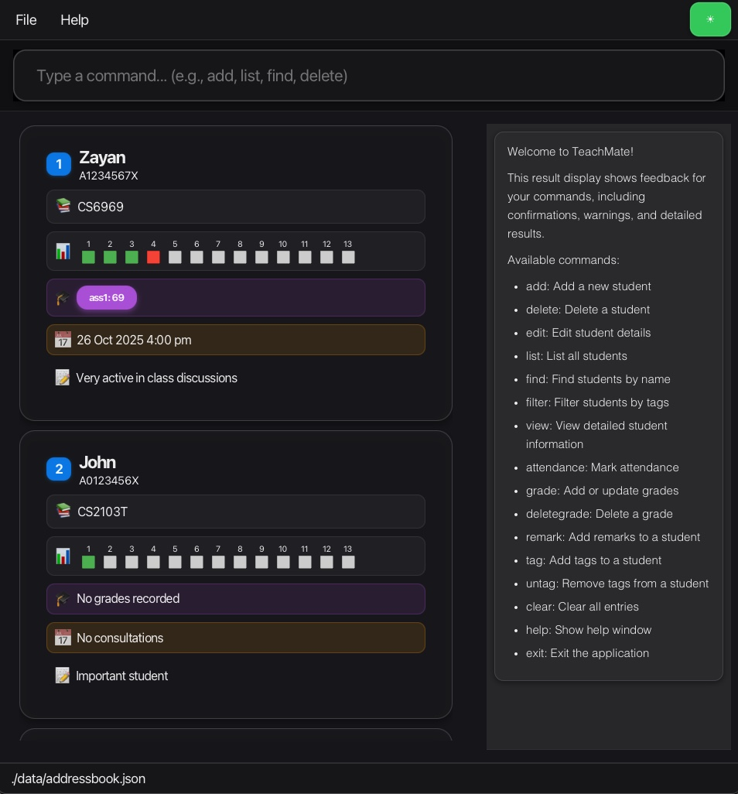

# TeachMate

**TeachMate** is a desktop application designed specifically for **NUS Teaching Assistants (TAs)** to streamline student management across multiple tutorial groups and modules. Built for TAs who prefer typing over clicking, TeachMate combines the speed of a Command Line Interface (CLI) with the clarity of a Graphical User Interface (GUI).

## Why TeachMate?

As an NUS TA juggling multiple modules, you need to efficiently:
* **Track attendance** across 13 weeks for dozens of students
* **Manage grades** for various assignments and assessments
* **Schedule consultations** while keeping track of who needs extra help
* **Remember student details** - who's struggling with OOP concepts, who excels at algorithms
* **Switch between modules** like CS2103T and CS2101 throughout the week

TeachMate solves these problems by putting everything in one place with fast, keyboard-driven commands.

## Key Features

* **Student Management**: Add and organize students with NUS-specific formats (student IDs like A0123456X, module codes like CS2103T)
* **Attendance Tracking**: Mark attendance with a single command and see visual color-coded grids (13 weeks at a glance)
* **Grade Management**: Add, update, and delete grades by assignment name with automatic syncing
* **Consultation Scheduling**: Record consultation appointments with date and time
* **Personalized Student Notes**: Add remarks to remember each student's learning journey and challenges
* **Multi-Module Organization**: Filter students by module to focus on one tutorial group at a time
* **Smart Filtering**: Tag students (e.g., "struggling", "excellent") and filter by tags to identify who needs attention
* **Fast Search**: Find students by name with keyboard shortcuts
* **Comprehensive View**: See all student details, attendance records, and consultation history in one view

## Target Users

NUS Teaching Assistants who:
* Manage multiple tutorial groups across different modules
* Prefer keyboard-driven interfaces for quick access during teaching sessions
* Type quickly and want to avoid point-and-click interfaces
* Need a centralized system to track attendance, grades, consultations, and student progress

## Documentation

* [User Guide](docs/UserGuide.md) - Learn how to use TeachMate
* [Developer Guide](docs/DeveloperGuide.md) - Learn how to develop TeachMate

## Acknowledgements

* This project is based on the AddressBook-Level3 project created by the [SE-EDU initiative](https://se-education.org).
* Libraries used: [JavaFX](https://openjfx.io/), [Jackson](https://github.com/FasterXML/jackson), [JUnit5](https://github.com/junit-team/junit5)
