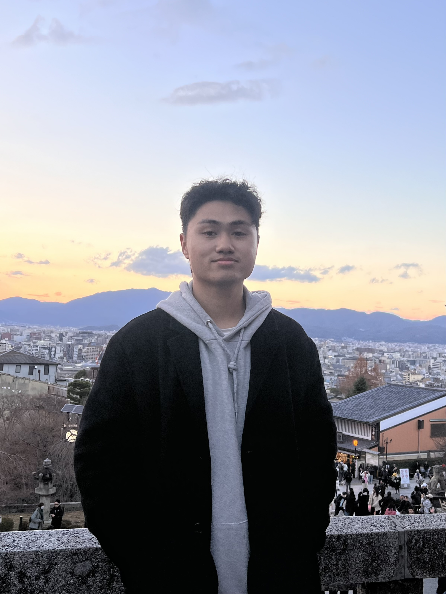

# About Us

We are a team based in the [School of Computing, National University of Singapore](http://www.comp.nus.edu.sg).

You can reach us at the email `seer[at]comp.nus.edu.sg`

## Project team

### Shao Zhi

[[homepage](http://www.comp.nus.edu.sg/~damithch)]
[[github](https://github.com/ShaoZhi21)]
[[portfolio](team/johndoe.md)]

* Role: Integration
* Responsibilites: Manage code integration and resolve conflicts  

### Kasim Zayan

[[github](http://github.com/ZayK1)]
[[portfolio](team/johndoe.md)]

* Role: Deliverables and deadlines
* Responsibilities: Ensure project deliverables are done on time and in the right format.

### Jing Xiang

[[github](http://github.com/jing-xiang-choong)] [[portfolio](team/johndoe.md)]

* Role: Code Quality
* Responsibilities: Looks after code quality, ensures adherence to coding standards, etc.

### Jean Doe

[[github](http://github.com/johndoe)]
[[portfolio](team/johndoe.md)]

* Role: Developer
* Responsibilities: Dev Ops + Threading

### James Doe

[[github](http://github.com/johndoe)]
[[portfolio](team/johndoe.md)]

* Role: Developer
* Responsibilities: UI
