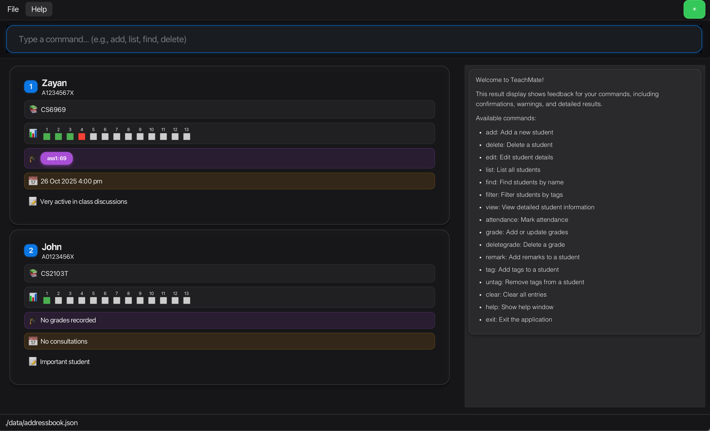
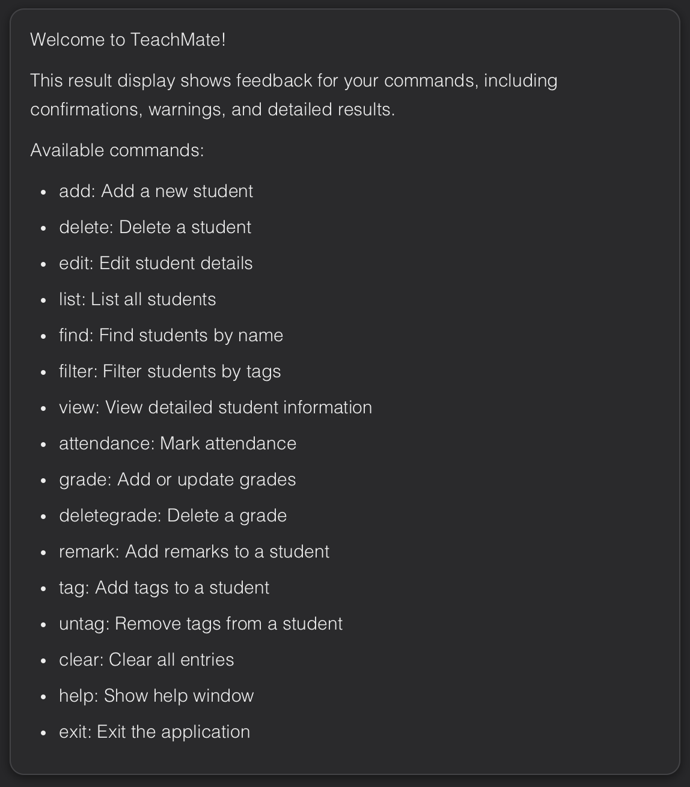
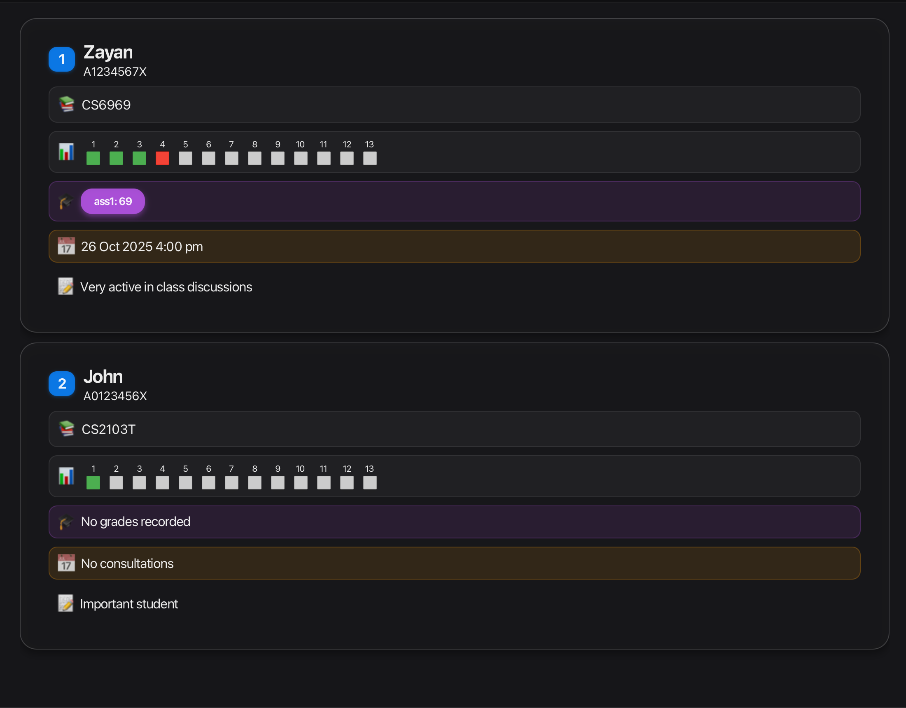

# TeachMate User Guide

**TeachMate** is a **desktop application designed specifically for NUS Teaching Assistants (TAs)** to streamline student management across multiple tutorial groups and modules. Built for TAs who prefer typing over clicking, TeachMate combines the speed of a Command Line Interface (CLI) with the clarity of a Graphical User Interface (GUI).

--------------------------------------------------------------------------------------------------------------------

## Why TeachMate?

### The TA's Challenge

As an NUS TA juggling multiple modules, you face unique challenges:

| 🎯 Challenge | 💡 Solution |
|-------------|------------|
| **Tracking attendance** across 13 weeks for dozens of students | Visual color-coded grids at a glance |
| **Managing grades** for various assignments and assessments | Centralized grade tracking on student cards |
| **Scheduling consultations** while keeping track of who needs extra help | Built-in consultation records |
| **Remembering student details** - who's struggling with OOP concepts | Personalized remarks system |
| **Switching between modules** like CS2103T and CS2101 | Multi-module filtering and organization |

### What TeachMate Does for You

**⚡ Instant Student Access** - View a student's complete profile including modules, grades, consultation history, attendance pattern, and your personal notes. No more hunting through spreadsheets or scrolling through email threads.

**📊 Effortless Attendance Tracking** - Mark attendance with a single command. See visual color-coded grids showing each student's 13-week attendance pattern at a glance - **green** for present, **red** for absent, **grey** for no record.

**📝 Smart Grade Management** - Add and update grades by assignment name, delete specific grades, and see all assignment scores displayed on each student card. No more maintaining separate Excel files.

**📅 Consultation Scheduling** - Record consultation appointments with date and time, view upcoming consultations for specific students, and keep track of who needs follow-up help.

**✏️ Personalized Student Notes** - Add remarks to remember each student's learning journey, challenges, and progress. Track observations like which concepts they struggle with or how they're improving over time.

**🏷️ Multi-Module Organization** - Filter students by module to focus on one tutorial group at a time. Tag students with labels like "struggling" or "excellent" and filter by tags to identify who needs attention.

**⌨️ Fast Keyboard Workflow** - Every action is a quick typed command. During live tutorials, you can mark attendance, add grades, or schedule consultations in seconds without taking your hands off the keyboard.

**Optimized for NUS Workflows** - TeachMate uses familiar formats like NUS student IDs and module codes. If you're comfortable with the terminal and type quickly, TeachMate will help you manage your students significantly faster than traditional point-and-click applications or multiple spreadsheets.


<!-- * Table of Contents -->
<page-nav-print />

--------------------------------------------------------------------------------------------------------------------

## Quick start

<box type="info" seamless>

**Before you begin - Prerequisites:**

* **Basic command line familiarity** - You should know how to open a terminal and navigate folders using `cd`
* **NUS context** - You're familiar with NUS student IDs (e.g., A0123456X) and module codes (e.g., CS2103T)
* **Typing preference** - You prefer typing commands over clicking buttons for faster workflows

</box>

1. Ensure you have Java `17` or above installed in your Computer.<br>
   **Mac users:** Ensure you have the precise JDK version prescribed [here](https://se-education.org/guides/tutorials/javaInstallationMac.html).

1. Download the latest `.jar` file from [here](https://github.com/AY2526S1-CS2103T-F11-3/tp/releases).

1. Copy the file to the folder you want to use as the _home folder_ for TeachMate.

1. Open a command terminal, `cd` into the folder you put the jar file in, and use the `java -jar addressbook.jar` command to run the application.<br>
   A GUI similar to the below should appear in a few seconds. Note how the app contains some sample data.<br>

### Understanding the Interface

Before you start using TeachMate, let's familiarize you with the main components of the application:

<p align="center">
  
</p>

**Figure 1: Main Interface** - The TeachMate desktop application showing the main interface with student cards displayed on the left and command results on the right. The interface uses a dark theme with color-coded sections for easy navigation.

<p align="center">
  
</p>

**Figure 2: Command Input Box** - The command input field at the top where you type commands. The blue glowing border indicates it's ready for input. This is where you'll enter all commands like `add`, `list`, `find`, etc.

<p align="center">
  
</p>

**Figure 3: Result Display Panel** - The right-side panel that shows feedback for your commands, confirmations, and detailed results. It also displays the welcome message and available commands when you first start the application.

<p align="center">
  
</p>

**Figure 4: Student Cards** - The left panel showing student cards with comprehensive information including attendance progress bars, grades, consultation schedules, and remarks. Each card is color-coded for quick visual reference.

<box type="tip" seamless>

**Ready to start?** Try typing `help` in the command box to see all available commands, or check out the [Features](#features) section below to learn about each command in detail.

</box>

--------------------------------------------------------------------------------------------------------------------

## Command Format Guide

<box type="tip" seamless>

### How Commands Work in TeachMate

TeachMate uses a simple command-based system. Think of it like typing instructions to the app. Here's what you need to know:

</box>

**1. Basic Command Structure**
* Every command starts with a command word (like `add`, `list`, `delete`)
* Commands are followed by parameters that provide the details
* Each parameter has a prefix (like `n/` for name, `s/` for student ID) followed by the value

**Example:** `add n/John Doe s/A0123456X`
* `add` is the command
* `n/John Doe` means name is "John Doe"
* `s/A0123456X` means student ID is "A0123456X"

**2. Understanding the Format Notation**

When you see a command format like this:
```
add n/NAME s/STUDENT_ID e/EMAIL [t/TAG]
```

Here's what the symbols mean:
* **Words in CAPS** (like `NAME`) = Replace with your actual information
* **[Square brackets]** = This part is optional - you can include it or skip it
* **`…` after a bracket** = You can repeat this part multiple times

**3. Common Prefixes You'll Use**
* `n/` = Student name
* `s/` = Student ID (e.g., A0123456X)
* `e/` = Email address
* `m/` = Module code (e.g., CS2103T)
* `t/` = Tag (a label like "struggling" or "excellent")
* `w/` = Week number (for attendance)
* `g/` = Grade (assignment name and score)
* `r/` = Remark (a note about the student)

**4. Helpful Tips**
* You can type parameters in any order - `add n/John s/A0123456X` works the same as `add s/A0123456X n/John`
* Don't worry about capitalization - commands work the same whether you type `ADD` or `add`
* When typing commands, just follow the pattern shown in the examples below

<box type="warning" seamless>

**Tip:** If you're ever unsure about a command, just type `help` to see all available commands with examples!

</box>

--------------------------------------------------------------------------------------------------------------------

## Features

### Viewing help : `help`

Shows a message explaining how to access the help page.


**Format:**
```
help
```
*Opens the help window with all available commands.*

**Example:**
```
help
```


### Adding a student: `add`

Adds a student to TeachMate.

**Format:**
```
add n/NAME s/STUDENT_ID e/EMAIL m/MODULE_CODE [m/MODULE_CODE]…​ [t/TAG]…​ [c/CONSULTATIONS]
```
*Creates a new student record with the specified details.*

**Examples:**
```
add n/John Doe s/A0123456X e/johnd@u.nus.edu m/CS2103T
```
```
add n/Jane Smith s/A0234567Y e/janes@u.nus.edu m/CS2103T m/CS2101 t/struggling t/needsHelp c/22/10/2025 15:30
```

<box type="info" seamless>

**Requirements:**
* `NAME` should only contain alphanumeric characters and spaces, and should not be blank
* `STUDENT_ID` must be in the format A followed by exactly 7 digits and 1 uppercase letter (e.g., A0123456X)
* `EMAIL` should be of the format local-part@domain (see detailed constraints below)
* `MODULE_CODE` must be in NUS format: 2-3 uppercase letters, followed by 4 digits, optionally ending with 1 uppercase letter (e.g., CS2103T, CS2101)
* `TAG` should be alphanumeric (no spaces)
* At least one module code is required
* Tags are optional
* Consultations are optional, if provided it should follow one of the supported formats listed below
</box>

<box type="tip" seamless>

**Email Constraints:**
* The local-part should only contain alphanumeric characters and these special characters: `+ _ . -`
* The local-part may not start or end with special characters
* The domain name must end with a domain label at least 2 characters long
* Each domain label must start and end with alphanumeric characters
* Each domain label may contain hyphens between alphanumeric characters
</box>

<box type="tip" seamless>

**Consultations Constraints**

- Consultations are optional — a student can be added without any consultations.
- If included, each consultation's date and time must follow **one of the supported formats** below:

| Accepted Format        | Example Input       |
|------------------------|---------------------|
| `dd/MM/yyyy HH:mm`     | `22/10/2025 15:30`  |
| `dd-MM-yyyy HH:mm`     | `22-10-2025 15:30`  |
| `yyyy-MM-dd HH:mm`     | `2025-10-22 15:30`  |
| `yyyy/MM/dd HH:mm`     | `2025/10/22 15:30`  |

*Notes*:
- The time must be entered in **24-hour format** (e.g., `14:00` for 2 PM).
- All formats require both a **date** and a **time** — partial inputs like `22/10/2025` or `15:30` alone are not accepted.
- Invalid inputs (e.g., `2025-13-45 25:99`) will result in an error message showing the supported formats.
</box>

### Listing students : `list`

Shows a list of all students in TeachMate, or filters students by module code.

**Format:**
```
list
```
*Displays all students in TeachMate.*

```
list m/MODULE_CODE
```
*Displays only students enrolled in the specified module.*

**Examples:**
```
list
```
```
list m/CS2103T
```

### Viewing a student : `view`

Views detailed information and attendance records about a student identified by their index or student ID.

**Format:**
```
view INDEX
```
*Shows detailed information for the student at the specified position in the list.*

```
view s/STUDENT_ID
```
*Shows detailed information for the student with the specified student ID.*

**Examples:**
```
view 1
```
```
view s/A0123456X
```

**Example output:**
```
=== STUDENT DETAILS ===
Name: John Doe
Student ID: A0123456X
Email: johnd@u.nus.edu
Modules: CS2103T, CS2101
Tags: struggling, needsHelp
Grades: Midterm: 85, Quiz1: 90
Remark: Very active in class discussions

=== ATTENDANCE RECORD ===
Week 1: ✓ Present
Week 2: ✗ Absent
Week 3: ✓ Present

=== CONSULTATION RECORDS ===
• 26 Oct 2025 4:00pm
• 03 Nov 2025 2:30pm
```

<box type="info" seamless>

**Requirements:**
* The index refers to the index number shown in the displayed student list
* The index **must be a positive integer** 1, 2, 3, …​
* Student ID must match the format A followed by 7 digits and 1 uppercase letter (e.g., A0123456X)
* The student must exist in TeachMate
* The display will automatically filter to show only the selected student
</box>

<box type="info" seamless>

**What will be displayed:**

The view command displays comprehensive information in three sections:

1. **Student Details:**
   * Full name
   * Student ID
   * Email address
   * All enrolled module codes (comma-separated)
   * Tags (if any, comma-separated)
   * Grades (if any, in format "assignment: score")
   * Remark (if any)

2. **Attendance Record:**
   * Week-by-week attendance status for all recorded weeks
   * Each entry shows: "Week [number]: [symbol] [status]"
   * Present weeks marked with: ✓ Present
   * Absent weeks marked with: ✗ Absent
   * Weeks are displayed in ascending order (Week 1, Week 2, etc.)
   * If no attendance has been recorded yet, displays: "No attendance recorded yet."

3. **Consultation Records:**
   * All scheduled consultation sessions with date and time
   * Displayed in chronological order
   * Format: "• [date] [time]" (e.g., "• 26 Oct 2025 4:00pm")
   * If no consultations are scheduled, displays: "No consultations recorded yet."
</box>

<box type="warning" seamless>

**Possible Error Messages:**
* If the index is invalid: `The student index provided is invalid`
* If the student ID is not found: `No student found with ID: [ID]`
</box>

<box type="tip" seamless>

**Tip:** After viewing a student, use the `list` command to see all students again.
</box>

### Marking attendance : `attendance`

Marks attendance for a student for a specific week.

**Format:**
```
attendance INDEX w/WEEK present|absent|unmark
```
*Marks attendance for the student at the specified position in the list.*

```
attendance s/STUDENT_ID w/WEEK present|absent|unmark
```
*Marks attendance for the student with the specified student ID.*

```
attendance all w/WEEK present|absent|unmark
```
*Marks attendance for all students at once.*

**Examples:**
```
attendance 1 w/1 present
```
```
attendance 2 w/2 absent
```
```
attendance 1 w/1 unmark
```
```
attendance s/A0123456X w/1 present
```
```
attendance all w/1 present
```

<box type="info" seamless>

**Requirements:**
* `INDEX` refers to the index number shown in the displayed student list (must be a positive integer)
* `STUDENT_ID` must match the format A followed by 7 digits and 1 uppercase letter
* `WEEK` must be a number between 1 and 13 (inclusive), representing the teaching week
* `present|absent|unmark` specifies the attendance status (case-insensitive):
  - `present`: Mark as present
  - `absent`: Mark as absent
  - `unmark`: Remove attendance record (return to unmarked state)
* The status must come **after** the week parameter
* Use `all` (without `s/` prefix) to mark all students at once for bulk operations
* The student must exist in TeachMate
* Marking attendance for the same week again will update the previous record
* Using `unmark` on an already unmarked week has no effect
</box>

<box type="success" seamless>

**Success Messages:**
* Individual: `Marked attendance for [name]: Week [week] - [status]` or `Unmarked attendance for [name]: Week [week]`
* All students: `Marked attendance for all students: Week [week] - [status] ([count] students)` or `Unmarked attendance for all students: Week [week] ([count] students)`
</box>

<box type="warning" seamless>

**Possible Error Messages:**
* If the index is invalid: `The student index provided is invalid`
* If the student ID is not found: `No student found with ID: [ID]`
* If the week is invalid: `Week should be a number between 1 and 13 (inclusive)`
* If the status is invalid: `Invalid attendance status. Use 'present', 'absent', or 'unmark'.`
</box>

<box type="tip" seamless>

**Tips:**
* Attendance can be viewed in detail using the `view` command, which shows week-by-week records
* When marking all students, the command affects every student in TeachMate regardless of the current filtered list
* Present attendance is marked with ✓ and absent with ✗ in the attendance record
* Unmarked attendance appears as grey boxes in the UI (no record)
* Using index is faster when working with the displayed list
* Use `unmark` to correct mistakes or reset attendance for a specific week
</box>

### Editing a student : `edit`

Edits an existing student in TeachMate. You can edit students whether they have phone/address (legacy data) or only have student-specific fields.

**Format:**
```
edit INDEX [n/NAME] [p/PHONE] [e/EMAIL] [a/ADDRESS] [s/STUDENT_ID] [m/MODULE_CODE]​ [t/TAG] [c/CONSULTATIONS] [g/ASSIGNMENT_NAME:SCORE] [w/WEEK_NUMBER:STATUS] [r/REMARK]
```
*Updates student information with the specified fields.*

**Examples:**
```
edit 1 s/A9999999Z e/newemail@u.nus.edu
```
```
edit 2 n/Jane Doe t/friends
```
```
edit 3 m/CS2103T m/CS2101
```
```
edit 1 g/Midterm:90
```
```
edit 2 w/5:present
```

<box type="info" seamless>

**Requirements:**
* The index refers to the index number shown in the displayed student list
* The index **must be a positive integer** 1, 2, 3, …​
* At least one of the optional fields must be provided
* Existing values will be overwritten by the input values
* When editing module codes, the existing module codes will be removed and replaced (not cumulative)
* When editing tags, the existing tags will be removed and replaced (not cumulative)
* You can remove all module codes by typing `m/` without specifying any module codes
* Editing consultations should still follow the same format as in the `add` command
* **Editing grades:** Use `g/ASSIGNMENT_NAME:SCORE` to update an existing grade. The assignment must already exist for the student, otherwise an error will be shown.
* **Editing attendance:** Use `w/WEEK_NUMBER:STATUS` to update attendance for a specific week (1-13). Status can be `present`, `absent`, or `unmark` (to remove the attendance record).
* **Editing remarks:** Use `r/REMARK` to update the remark for a student.
</box>

<box type="warning" seamless>

**Note about legacy fields:**
The edit command still supports `p/PHONE` and `a/ADDRESS` prefixes for backward compatibility with older data. However, new students added via the `add` command will not have phone or address fields.
</box>

### Adding tags to a student : `tag`

Adds one or more tags to an existing student in TeachMate without removing existing tags.

**Format:**
```
tag INDEX t/TAG [t/TAG]…​
```
*Adds tags to the student at the specified position in the list.*

```
tag s/STUDENT_ID t/TAG [t/TAG]…​
```
*Adds tags to the student with the specified student ID.*

**Examples:**
```
tag 1 t/Struggling t/Inactive
```
```
tag s/A0291772W t/Excelling
```
```
tag 2 t/needsHelp
```

<box type="info" seamless>

**Requirements:**
* The index refers to the index number shown in the displayed student list
* The index **must be a positive integer** 1, 2, 3, …​
* Student ID must match the format A followed by 7 digits and 1 uppercase letter
* At least one tag must be provided
* Tags are added to existing tags (not replaced)
* Duplicate tags that already exist on the student will still be added
* `TAG` should be alphanumeric (no spaces)
</box>

### Removing tags from a student : `untag`

Removes one or more tags from an existing student in TeachMate.

**Format:**
```
untag INDEX t/TAG [t/TAG]…​
```
*Removes tags from the student at the specified position in the list.*

```
untag s/STUDENT_ID t/TAG [t/TAG]…​
```
*Removes tags from the student with the specified student ID.*

**Examples:**
```
untag 1 t/Struggling
```
```
untag s/A0291772W t/Struggling t/Inactive
```
```
untag 2 t/needsHelp
```

<box type="info" seamless>

**Requirements:**
* The index refers to the index number shown in the displayed student list
* The index **must be a positive integer** 1, 2, 3, …​
* Student ID must match the format A followed by 7 digits and 1 uppercase letter
* At least one tag must be provided
* All specified tags must exist on the student, otherwise an error will be shown
* `TAG` should be alphanumeric (no spaces)
</box>

<box type="warning" seamless>

**Note:** If you try to remove a tag that doesn't exist on the student, the command will fail and show you which tags are missing. Make sure the tags you want to remove are currently on the student.
</box>

### Adding or updating grades for a student : `grade`

Adds new grades or updates existing grades for a student in TeachMate.

**Format:**
```
grade INDEX g/ASSIGNMENT_NAME:SCORE [g/ASSIGNMENT_NAME:SCORE]…​
```
*Adds or updates grades for a student's assignments.*

**Examples:**
```
grade 1 g/Midterm:85
```
```
grade 2 g/Quiz1:90 g/Assignment1:88
```
```
grade 3 g/Final Exam:92
```
```
grade 1 g/MIDTERM:90
```

<box type="info" seamless>

**Requirements:**
* The index refers to the index number shown in the displayed student list
* The index **must be a positive integer** 1, 2, 3, …​
* At least one grade must be provided
* Each grade consists of an assignment name and a score separated by a colon `:`
* `ASSIGNMENT_NAME` should not be blank
* `SCORE` must be a number between 0 and 100 (inclusive)
* Only students (those with Student IDs) can have grades added
* **Assignment names are case-insensitive** (e.g., "Midterm", "midterm", and "MIDTERM" refer to the same assignment)
* If a grade for an assignment already exists, it will be **updated** with the new score
* New grades are added without affecting other existing grades
</box>

<box type="tip" seamless>

**Tips:**
* You can add multiple grades in one command by using multiple `g/` prefixes
* Grades will appear as purple badges in the student card, below the email
* Assignment names can contain spaces (e.g., "Final Exam")
* If you add a grade for an assignment that already exists (case-insensitive), the old score will be replaced with the new score
* Grades are automatically saved and will persist across application restarts
</box>

### Deleting grades from a student : `deletegrade`

Deletes specific grades from an existing student in TeachMate.

**Format:**
```
deletegrade INDEX g/ASSIGNMENT_NAME [g/ASSIGNMENT_NAME]…​
```
*Deletes specified grade assignments from a student.*

**Examples:**
```
deletegrade 1 g/Midterm
```
```
deletegrade 2 g/Quiz1 g/Assignment1
```

<box type="info" seamless>

**Requirements:**
* The index refers to the index number shown in the displayed student list
* The index **must be a positive integer** 1, 2, 3, …​
* At least one assignment name must be provided
* Assignment names must match exactly (case-sensitive)
* Only students (those with Student IDs) can have grades deleted
* All specified assignment names must exist for the student
</box>

### Adding remarks to a student : `remark`

Adds or updates a personalized remark for an existing student in TeachMate.

**Format:**
```
remark s/STUDENT_ID r/REMARK
```
*Adds or updates a personalized remark for a student.*

**Examples:**
```
remark s/A0123456X r/Needs extra help with OOP concepts
```
```
remark s/A0234567Y r/Excellent participation in tutorials
```
```
remark s/A0345678Z r/Struggling with time management. Recommended office hours on Fridays.
```

<box type="info" seamless>

**Requirements:**
* Student ID must match the format A followed by 7 digits and 1 uppercase letter
* `REMARK` can contain any text including spaces and special characters
* `REMARK` supports multi-line text for longer notes
* The remark must not be blank (must contain at least one non-whitespace character)
* Existing remarks will be overwritten by the new remark (not cumulative)
* The student must exist in TeachMate
</box>

<box type="tip" seamless>

**Tips:**
* Use remarks to record personalized notes about each student (e.g., learning preferences, areas of difficulty, progress notes)
* Remarks are displayed in the student card view with a 📝 icon
* To view all details including remarks, use the student card in the list view
* Remarks are automatically saved and will persist across application restarts
</box>

### Locating students by name: `find`

Finds students whose names contain any of the given keywords.

**Format:**
```
find KEYWORD [MORE_KEYWORDS]
```
*Searches for students whose names contain any of the given keywords.*

**Examples:**
```
find Zayan
```
```
find Ze Xuan
```

<box type="info" seamless>

**Requirements:**
* The search is case-insensitive (e.g. `john` will match `John`)
* The order of the keywords does not matter (e.g. `John Doe` will match `Doe John`)
* Only the name is searched
* Only full words will be matched (e.g. `Joh` will not match `John`)
* Students matching at least one keyword will be returned (i.e. `OR` search)
</box>

### Filtering students by tags: `filter`

Filters students who have all of the specified tags.

**Format:**
```
filter t/TAG [t/MORE_TAGS]…​
```
*Filters and displays students who have all of the specified tags.*

**Examples:**
```
filter t/friends
```
```
filter t/struggling t/needsHelp
```
```
filter t/help
```
```
filter t/FRIEND
```

<box type="info" seamless>

**Requirements:**
* At least one tag must be provided
* Only students who have **all** the specified tags will be shown (i.e. `AND` search)
* **Tag matching is case-insensitive** (e.g., `Friends` matches `friends`)
* **Substring matching is supported** (e.g., `help` matches tags containing "help" like `needHelp`)
* Tags must be alphanumeric (no spaces)
</box>

### Deleting a student : `delete`

Deletes the specified student from TeachMate.

**Format:**
```
delete INDEX
```
*Deletes the student at the specified position in the list.*

```
delete s/STUDENT_ID
```
*Deletes the student with the specified student ID.*

<box type="info" seamless>

**Requirements:**
* The index refers to the index number shown in the displayed student list
* The index **must be a positive integer** 1, 2, 3, …​
* Student ID must match the format A followed by 7 digits and 1 uppercase letter (e.g., A0123456X)
</box>

**Examples:**
```
delete 2
```
```
delete s/A0123456X
```

### Clearing all entries : `clear`

Clears all entries from TeachMate.

**Format:**
```
clear
```
*Deletes all students from TeachMate permanently.*

<box type="warning" seamless>

**Warning:** This action cannot be undone. All student data will be permanently deleted.
</box>

**Example:**
```
clear
```

### Exiting the program : `exit`

Exits the program.

**Format:**
```
exit
```
*Closes the TeachMate application.*

**Example:**
```
exit
```

### Saving the data

<box type="info" seamless>

TeachMate data are saved in the hard disk automatically after any command that changes the data. There is no need to save manually.
</box>

### Editing the data file

<box type="info" seamless>

TeachMate data are saved automatically as a JSON file `[JAR file location]/data/addressbook.json`. Advanced users are welcome to update data directly by editing that data file.
</box>

<box type="warning" seamless>

**Caution:**
If your changes to the data file makes its format invalid, TeachMate will discard all data and start with an empty data file at the next run. Hence, it is recommended to take a backup of the file before editing it.<br>
Furthermore, certain edits can cause TeachMate to behave in unexpected ways (e.g., if a value entered is outside the acceptable range). Therefore, edit the data file only if you are confident that you can update it correctly.
</box>

--------------------------------------------------------------------------------------------------------------------

## FAQ

<box type="tip" seamless>

**Q: How do I transfer my data to another Computer?**

Install the app in the other computer and overwrite the empty data file it creates with the file that contains the data of your previous TeachMate home folder.
</box>

<box type="tip" seamless>

**Q: What is the student ID format?**

Student IDs must follow the NUS format: A followed by exactly 7 digits and 1 uppercase letter (e.g., A0123456X, A1234567B).
</box>

<box type="tip" seamless>

**Q: Can I add a student without module codes?**

No, every student must have at least one module code when using the `add` command.
</box>

<box type="tip" seamless>

**Q: Why does the edit command still accept phone (p/) and address (a/) prefixes?**

For backward compatibility with older data that may contain phone and address information. New students added via the `add` command will only have student-specific fields (student ID, module codes).
</box>

<box type="tip" seamless>

**Q: Can tags contain spaces?**

No, tags must be alphanumeric without spaces. Use camelCase or single words (e.g., `needsHelp`, `struggling`).
</box>

<box type="tip" seamless>

**Q: Can I edit or delete grades after adding them?**

Yes! You can update grades by using the `grade` command with the same assignment name (case-insensitive). For example, if a student has "Midterm: 85", running `grade 1 g/Midterm:90` will update it to 90. To delete grades, use the `deletegrade` command. For example, `deletegrade 1 g/Midterm` will remove the Midterm grade from student 1.
</box>

<box type="tip" seamless>

**Q: Why can't I add grades to a person without a student ID?**

Grades are only applicable to students. The system requires students to have a student ID to ensure grades are tracked for the right individuals.
</box>

<box type="tip" seamless>

**Q: What happens to grades when I edit or delete a student?**

When you edit a student's information (name, email, etc.), their grades are preserved. If you delete a student, all their associated grades are permanently deleted as well.
</box>

--------------------------------------------------------------------------------------------------------------------

## Known issues

<box type="warning" seamless>

**1. Multiple Screen Issue**

If you move the application to a secondary screen, and later switch to using only the primary screen, the GUI will open off-screen.

**Solution:** Delete the `preferences.json` file created by the application before running the application again.
</box>

<box type="warning" seamless>

**2. Minimized Help Window Issue**

If you minimize the Help Window and then run the `help` command (or use the `Help` menu, or the keyboard shortcut `F1`) again, the original Help Window will remain minimized, and no new Help Window will appear.

**Solution:** Manually restore the minimized Help Window.
</box>

--------------------------------------------------------------------------------------------------------------------

## Command summary

| Action     | Format, Examples                                                                                                                                                          |
|------------|---------------------------------------------------------------------------------------------------------------------------------------------------------------------------|
| **Add**    | `add n/NAME s/STUDENT_ID e/EMAIL m/MODULE_CODE [m/MODULE_CODE]…​ [t/TAG]…​` <br> e.g., `add n/John Doe s/A0123456X e/johnd@u.nus.edu m/CS2103T m/CS2101 t/struggling`  |
| **Clear**  | `clear`                                                                                                                                                                   |
| **Delete** | `delete INDEX`<br> e.g., `delete 3`                                                                                                                                       |
| **Edit**   | `edit INDEX [n/NAME] [p/PHONE] [e/EMAIL] [a/ADDRESS] [s/STUDENT_ID] [m/MODULE_CODE]…​ [t/TAG]…​`<br> e.g., `edit 2 n/Jane Lee s/A9999999Z`                              |
| **Filter** | `filter t/TAG [t/MORE_TAGS]…​`<br> e.g., `filter t/struggling t/needsHelp`                                                                                               |
| **Find**   | `find KEYWORD [MORE_KEYWORDS]`<br> e.g., `find John Jane`                                                                                                                |
| **Grade**  | `grade INDEX g/ASSIGNMENT_NAME:SCORE [g/ASSIGNMENT_NAME:SCORE]…​`<br> e.g., `grade 1 g/Midterm:85 g/Quiz1:90`                                                            |
| **Delete Grade** | `deletegrade INDEX g/ASSIGNMENT_NAME [g/ASSIGNMENT_NAME]…​`<br> e.g., `deletegrade 1 g/Midterm g/Quiz1`                                                           |
| **List**   | `list` or `list m/MODULE_CODE`<br> e.g., `list m/CS2103T`                                                                                                                |
| **Remark** | `remark s/STUDENT_ID r/REMARK`<br> e.g., `remark s/A0123456X r/Needs extra help with OOP concepts`                                                                       |
| **Tag**    | `tag INDEX t/TAG [t/TAG]…​` or `tag s/STUDENT_ID t/TAG [t/TAG]…​`<br> e.g., `tag 1 t/Struggling t/Inactive` or `tag s/A0291772W t/Excelling`                            |
| **Untag**  | `untag INDEX t/TAG [t/TAG]…​` or `untag s/STUDENT_ID t/TAG [t/TAG]…​`<br> e.g., `untag 1 t/Struggling` or `untag s/A0291772W t/Inactive`                                |
| **View**   | `view INDEX` or `view s/STUDENT_ID`<br> e.g., `view 1` or `view s/A0123456X`                                                                                             |
| **Attendance** | `attendance INDEX w/WEEK present|absent|unmark` or `attendance s/STUDENT_ID w/WEEK present|absent|unmark` or `attendance all w/WEEK present|absent|unmark`<br> e.g., `attendance 1 w/1 present` or `attendance s/A0123456X w/1 unmark` or `attendance all w/1 absent` |
| **Help**   | `help`                                                                                                                                                                    |
| **Exit**   | `exit`                                                                                                                                                                    |
